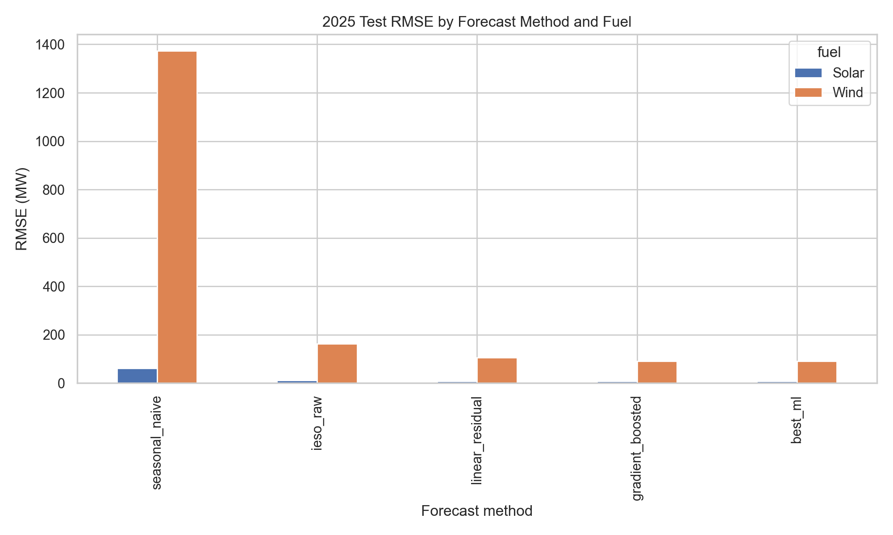
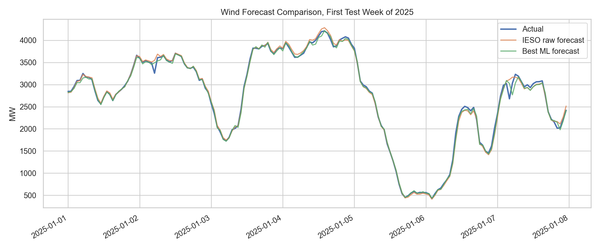
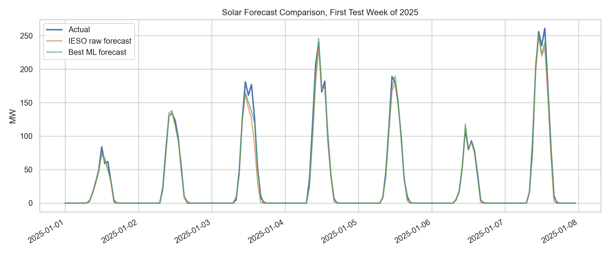
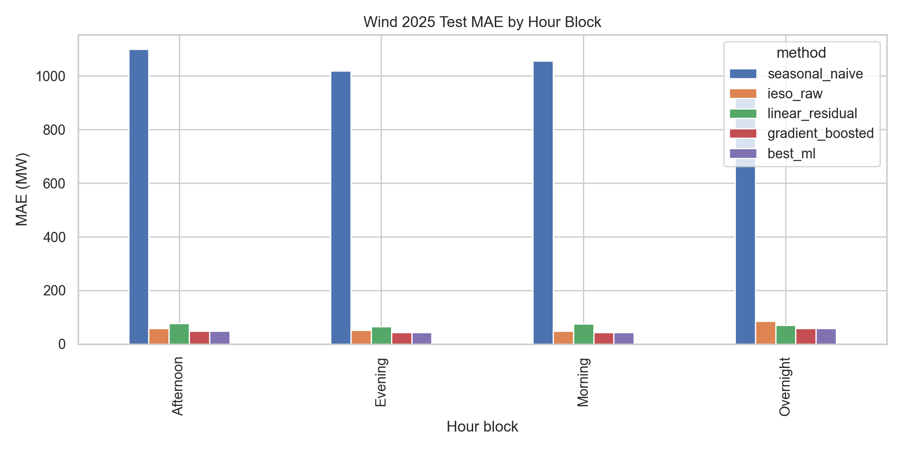
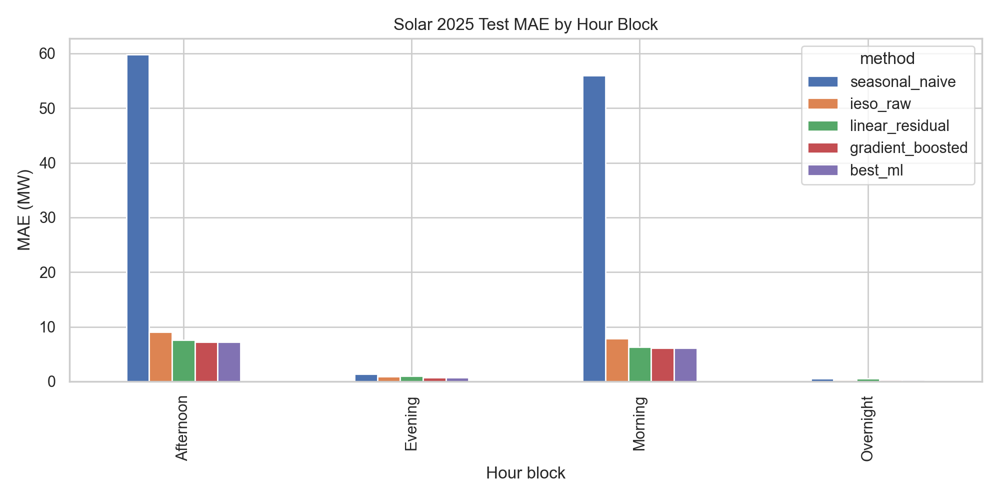
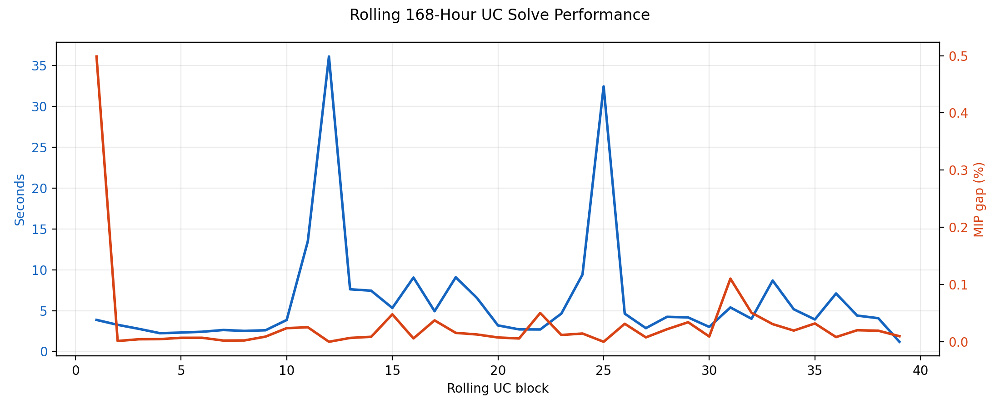
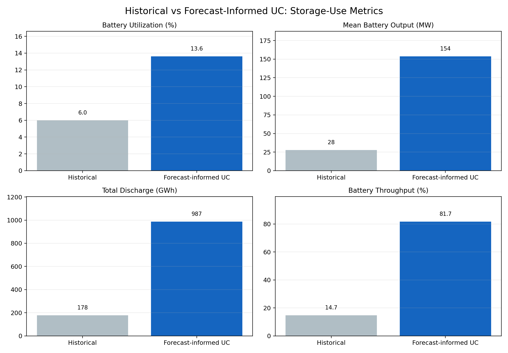
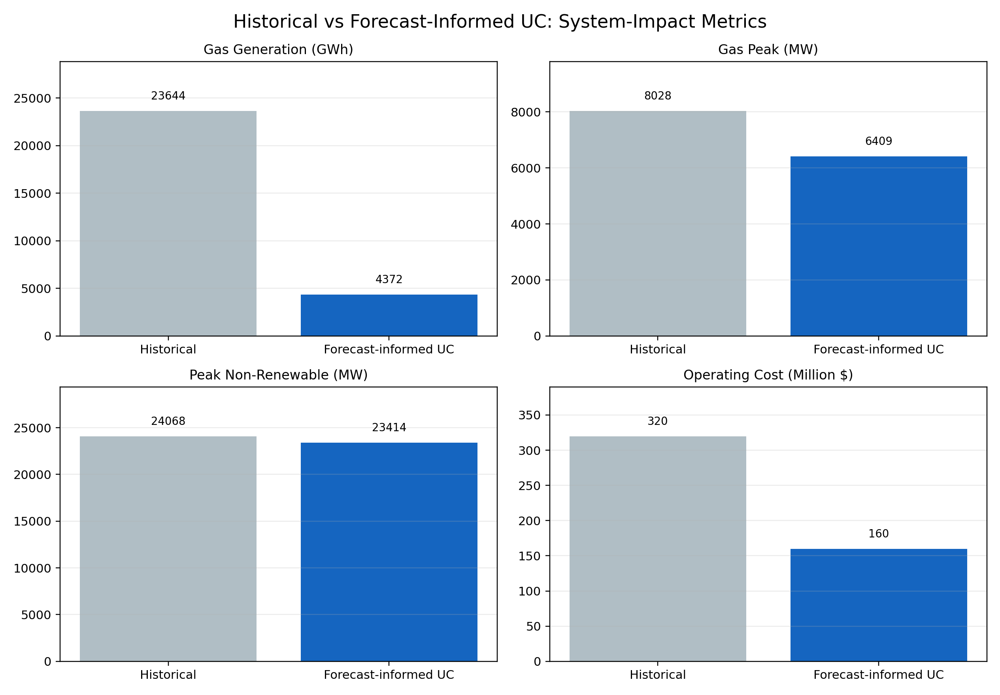
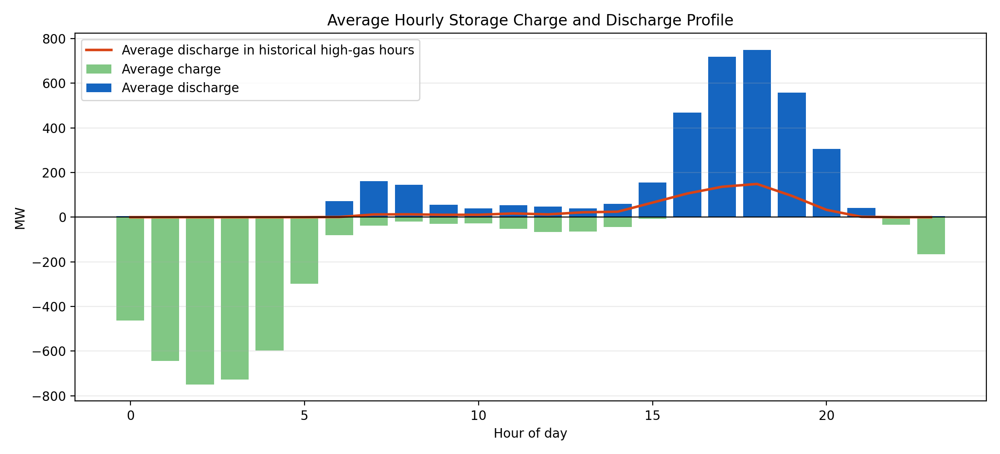
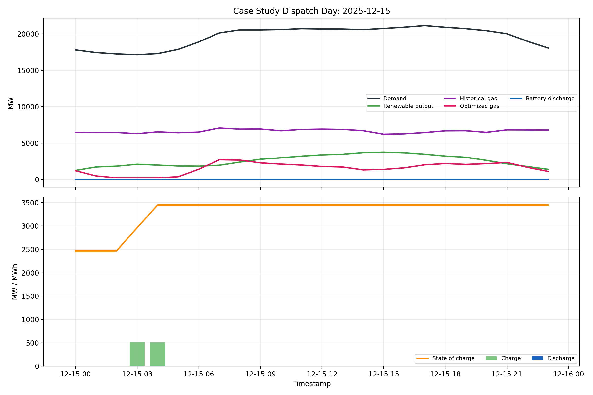

# MSE 433 Individual Final Project

## Forecast-Informed Storage Dispatch with Generator-Level Unit Commitment

### Executive Summary
This project evaluates whether better renewable forecasts can improve how Ontario dispatches battery storage when storage decisions are embedded inside a generator-level unit commitment model. The final workflow combines data engineering, parameter estimation, renewable forecasting, and a rolling mixed-integer optimization model that co-optimizes storage operation with broader system constraints.

The final historical panel covers **2019-05-01 to 2025-12-31** with **57,023 hourly observations**. The main optimization uses the observed current-storage window from **2025-04-08 08:00:00 to 2025-12-31 23:00:00**, totaling **6,423 hours**, and solves a **168-hour rolling generator-level UC**.

The headline result is:

- Ontario's **historical observed battery utilization** averaged **5.99%**.
- Under the 168-hour forecast-informed generator UC, battery utilization rises to **13.61%**, an increase of **7.62 percentage points**.
- Mean battery output rises from **27.70 MW** historically to **153.65 MW**.
- Peak non-renewable requirement falls by **654.00 MW** relative to history.
- Total battery discharge increases by **809,003 MWh** over the modeled window.
- Modeled gas generation falls by **19,271,911 MWh** relative to historical operation.
- Modeled operating cost falls by **$159,714,797** relative to the historical baseline.
- Average discharge during historical high-gas hours reaches **295.21 MW**.

Taken together, the final model shows that the project improves **both operational performance and modeled system economics**: the battery fleet is used more often and more strategically, while the UC solution also lowers modeled operating cost.

### Problem Framing
The stakeholder is an Ontario planner or storage operator deciding how storage should be dispatched to make renewable energy more operationally useful while respecting broader system operating constraints. The final question is not just whether storage can cycle more often, but whether better forecasts and a more physical dispatch model make the current Ontario battery fleet materially more valuable.

The model uses:

- Ontario hourly demand as the system load target
- wind and solar output, forecast, and available capacity from the IESO monthly Generator Output and Capability files
- observed storage rows from the same monthly files as the historical baseline
- generator-level capability, cost, minimum up/down, and ramp parameters from `GeneratorParamaters.csv`

This supports a clearer operations-focused question:

**If Ontario dispatches storage using improved renewable forecasts inside a generator-level UC model, how much more useful does storage become compared with the historical operating pattern?**

### Data and Parameter Estimation
The final dataset and parameter file were rebuilt using this repository's own processed hourly generator tables rather than the earlier external parsed files.

- **129 dispatchable units** are represented in the UC dataset.
- **52 renewable units** are represented in the renewable dataset.
- **182 generators** receive final parameter estimates in `Data/GeneratorParamaters.csv`.
- The observed storage baseline is drawn from the storage assets explicitly visible in the source files during the 2025 overlap window.

The parameter-estimation workflow in `scripts/paramater_estimation.ipynb` follows the same methodology as the earlier notebook, but now uses this repository's processed generator data:

1. **`P_max`** is estimated as the maximum observed hourly capability for each generator.
2. **`P_min`** is estimated as the minimum non-zero observed hourly output.
3. **Minimum up/down times** are estimated from historical on/off run lengths using a Kaplan-Meier style survival calculation, then smoothed by fuel type for generators with sparse cycling data.
4. **Ramp rates** are initially estimated from the 95th percentile of observed positive hour-to-hour output changes.
5. **Physical ramp overrides** are then applied to match the final UC assumptions:
   - `NUCLEAR`: **60% of rated power per hour**
   - `HYDRO`: **0 to Pmax within one hour**
6. **Startup and shutdown costs** are derived from estimated ramp durations and variable-cost assumptions.
7. **Commission year** is inferred from the first valid appearance of each unit in the historical data.

This matters for the project because the final optimization is no longer relying on generic textbook parameters. The UC is driven by Ontario-specific empirical estimates, plus explicit physics-based overrides where the empirical ramps were not realistic for continuous units.

Table 1 summarizes the main before-versus-after metrics used throughout the report:

| metric                         | historical_actual   | forecast_informed_uc   | improvement             |
|:-------------------------------|:--------------------|:-----------------------|:------------------------|
| Battery power utilization      | 5.99%               | 13.61%                 | 7.62 percentage points  |
| Mean battery output            | 27.70 MW            | 153.65 MW              | 125.95 MW               |
| Battery throughput utilization | 14.72%              | 81.66%                 | 66.94 percentage points |
| Total battery discharge        | 177,900 MWh         | 986,903 MWh            | 809,003 MWh             |
| Gas generation saved           | 0 MWh               | 19,271,911 MWh         | 3000.45 MW average      |
| Gas peak reduction             | 0 MW                | 1619 MW                | 1619 MW                 |
| Modeled operating cost         | $319,638,428        | $159,923,631           | $159,714,797 saved      |
| Peak non-renewable reduction   | 0 MW                | 654 MW                 | 654 MW                  |

### Forecasting Results
The forecasting stage remains a separate supervised-learning problem that feeds directly into the UC model. Four renewable forecast methods were compared:

- seasonal naive
- raw IESO forecast
- linear residual correction
- gradient-boosted residual correction

The best ML model for each renewable fuel was:

- Wind: **gradient_boosted**
- Solar: **gradient_boosted**

On the locked 2025 test set, the best ML forecast reduced RMSE by **43.67% for wind** and **24.50% for solar** relative to the raw IESO forecast.

The residual-correction models use more than the raw IESO forecast alone. The final feature set includes cyclical hour/day/month encodings, lagged renewable output at **1, 24, and 168 hours**, lagged Ontario demand, lagged opposite-fuel renewable output, lagged forecast-error terms, and rolling means over **24-hour** and **168-hour** windows. This strengthens the technical depth of the forecasting stage because the model explicitly uses time-series structure and broader system context rather than relying only on a black-box fit.

Wind 2025 test metrics:

| method           |    mae_mw |   rmse_mw |   nmae_vs_available_capacity |   nrmse_vs_available_capacity |
|:-----------------|----------:|----------:|-----------------------------:|------------------------------:|
| gradient_boosted |   48.2581 |   91.6789 |                    0.0100162 |                     0.0190284 |
| best_ml          |   48.2581 |   91.6789 |                    0.0100162 |                     0.0190284 |
| linear_residual  |   72.2624 |  106.128  |                    0.0149984 |                     0.0220274 |
| ieso_raw         |   61.2582 |  162.746  |                    0.0127145 |                     0.0337787 |
| seasonal_naive   | 1031.02   | 1373.03   |                    0.213993  |                     0.284979  |

Solar 2025 test metrics:

| method           |   mae_mw |   rmse_mw |   nmae_vs_available_capacity |   nrmse_vs_available_capacity |
|:-----------------|---------:|----------:|-----------------------------:|------------------------------:|
| gradient_boosted |  3.59903 |   8.25187 |                   0.0083606  |                     0.0191692 |
| best_ml          |  3.59903 |   8.25187 |                   0.0083606  |                     0.0191692 |
| linear_residual  |  3.83928 |   8.40705 |                   0.00891871 |                     0.0195297 |
| ieso_raw         |  4.51889 |  10.9295  |                   0.0104975  |                     0.0253894 |
| seasonal_naive   | 29.4132  |  62.2071  |                   0.0683273  |                     0.144508  |

*Figure 1. Test-set RMSE comparison across renewable forecast methods.*

*Figure 2. Wind forecast comparison over the first week of the 2025 holdout period.*

*Figure 3. Solar forecast comparison over the first week of the 2025 holdout period.*

*Figure 4. Wind MAE by hour block.*

*Figure 5. Solar MAE by hour block.*

The 30-day public forecast scrape remains supporting context. In that window, there were **706 publication snapshots** and **710,595 rows**, spanning **2026-03-09 to 2026-04-07**.

### Generator-Level UC Formulation
The main optimization is a **rolling 168-hour generator-level mixed-integer unit commitment model** with storage. This is the main project approach.

The model includes:

- explicit hourly power balance
- generator-level dispatch variables
- binary commitment for `GAS` and `BIOFUEL` units
- startup and shutdown costs
- minimum and maximum output constraints
- minimum up and minimum down constraints
- ramp constraints
- battery charge, discharge, state of charge, and charge/discharge exclusivity
- renewable allocation across direct use, storage charging, and curtailment

The optimization objective is to minimize simulated system operating cost while preserving feasibility and renewable-backed flexibility. In practice, that means:

- variable generation cost for each dispatchable unit
- startup and shutdown costs for binary thermal units
- load-shedding penalties
- overgeneration penalties
- a small battery-throughput penalty
- stress-hour adder terms so the optimizer values storage support more during historically difficult hours

To make the continuous-unit ramping more realistic, the final model uses the following final overrides:

- `NUCLEAR`: **1% of rated power per minute**, or **60% of rated power per hour**
- `HYDRO`: allowed to move from **0 to Pmax within the hour**

These assumptions resolved the earlier ramp infeasibility while keeping binary thermal UC ramping strict for `GAS` and `BIOFUEL`.

Table 2 summarizes the technical performance of the rolling UC solves:

| metric                    | value   |
|:--------------------------|:--------|
| Rolling UC blocks solved  | 39      |
| Mean solve time per block | 6.31 s  |
| Max solve time per block  | 36.08 s |
| Mean MIP gap              | 0.031%  |
| Max MIP gap               | 0.499%  |
| Total ramp slack used     | 0.00 MW |

### Benchmark Structure
The current main result table compares:

- `historical_actual`: real observed storage operation
- `forecast_informed_uc`: the forecast-informed 168-hour generator UC policy

This is the strongest direct baseline comparison for the current submission because it compares the actual Ontario operating pattern against the final physical optimization model.

To avoid overstating the value of the UC framework itself, the project also retains an all-policies benchmark layer with `no_storage_uc` and `perfect_foresight_uc`. This makes it possible to separate the value of battery dispatch inside UC from the broader effect of moving from historical operation into a more physical model.

Storage scenario assumption:

- Current observed fleet in source files: **1129 MW / 4516 MWh**

### Policy Decomposition: UC Effect vs Battery Effect
To separate gains from the UC framework itself from gains created by storage dispatch, the project also ran an all-policies benchmark set:

- `historical_actual`
- `no_storage_uc`
- `forecast_informed_uc`
- `perfect_foresight_uc`

Policy levels:

| Policy               |   Battery utilization (%) |   Mean battery output (MW) |   Total discharge (MWh) |   Modeled gas dispatch (MWh) |   Modeled gas peak (MW) |   Peak non-renewable requirement (MW) |   Modeled operating cost (USD) |
|:---------------------|--------------------------:|---------------------------:|------------------------:|-----------------------------:|------------------------:|--------------------------------------:|-------------------------------:|
| historical_actual    |                         6 |                      27.7  |                 177,900 |                            0 |                         |                               24068   |                    319,638,428 |
| no_storage_uc        |                         0 |                       0    |                       0 |                    4,953,312 |                 7235.78 |                               24240.8 |                    161,543,069 |
| forecast_informed_uc |                        14 |                     153.65 |                 986,903 |                    4,372,068 |                 6409    |                               23414   |                    159,923,631 |
| perfect_foresight_uc |                        14 |                     153.6  |                 986,565 |                    4,390,797 |                 6431    |                               23436   |                    160,016,381 |

Decomposition of gains:

| comparison                                | interpretation                          |   Battery utilization delta (pp) |   Mean battery output delta (MW) |   Battery discharge delta (MWh) |   Gas dispatch delta (MWh) |   Gas peak delta (MW) |   Peak non-renewable delta (MW) |   Operating cost delta (USD) |
|:------------------------------------------|:----------------------------------------|---------------------------------:|---------------------------------:|--------------------------------:|---------------------------:|----------------------:|--------------------------------:|-----------------------------:|
| Historical to UC without storage          | Modeling context only                   |                            -5.99 |                           -27.7  |                        -177,900 |                  4,953,312 |               7235.78 |                          172.78 |                 -158,095,359 |
| UC no-storage to forecast-informed UC     | Incremental battery value inside UC     |                            13.61 |                           153.65 |                         986,903 |                   -581,243 |               -826.78 |                         -826.78 |                   -1,619,438 |
| Historical to forecast-informed UC        | Total improvement versus real operation |                             7.62 |                           125.95 |                         809,003 |                  4,372,068 |               6409    |                         -654    |                 -159,714,797 |
| Forecast-informed to perfect-foresight UC | Remaining forecast gap                  |                            -0    |                            -0.05 |                            -338 |                     18,729 |                 22    |                           22    |                       92,750 |

The most important apples-to-apples comparison is **`no_storage_uc -> forecast_informed_uc`**, because both policies use the same UC model and differ mainly in whether the battery is actively dispatched. In that comparison:

- battery utilization increases by **13.61 percentage points**
- mean battery output increases by **153.65 MW**
- total battery discharge increases by **986,903 MWh**
- modeled gas dispatch falls by **581,243 MWh**
- modeled gas peak falls by **826.78 MW**
- modeled operating cost falls by **$1,619,438**

This decomposition is important because it shows that the reported gains are not only a consequence of switching to a UC model. The UC framework provides the physical operating context, but the incremental reduction in gas use, gas peak, and modeled operating cost comes from **battery utilization inside that UC framework**.

### Main Results
Current main comparison:

| policy               |   mean_battery_power_utilization |   mean_battery_output_mw |   renewable_utilization_rate |   peak_residual_nonrenewable_reduction_vs_historical_mw |   gas_generation_saved_vs_historical_mwh |   average_gas_generation_saved_mw |   gas_peak_reduction_vs_historical_mw |   high_gas_hour_average_discharge_mw |
|:---------------------|---------------------------------:|-------------------------:|-----------------------------:|--------------------------------------------------------:|-----------------------------------------:|----------------------------------:|--------------------------------------:|-------------------------------------:|
| historical_actual    |                        0.0598944 |                  27.6973 |                            1 |                                                       0 |                              0           |                              0    |                                     0 |                                0     |
| forecast_informed_uc |                        0.136095  |                 153.651  |                            1 |                                                     654 |                              1.92719e+07 |                           3000.45 |                                  1619 |                              295.209 |

*Figure 5. Historical versus forecast-informed UC comparison for battery utilization, mean battery output, total discharge, and battery throughput.*

*Figure 6. Historical versus forecast-informed UC comparison for gas generation, gas peak, peak non-renewable requirement, and modeled operating cost.*

Key impacts:

- The historical baseline shows how Ontario actually used the battery fleet.
- The forecast-informed UC shows how that same fleet performs under a more physical dispatch model with commitment, ramping, startup/shutdown, and battery constraints.
- **Battery utilization rises from 5.99% to 13.61%.**
- **Battery throughput utilization rises from 14.72% to 81.66%.**
- **Total discharge rises from 177,900 MWh to 986,903 MWh.**
- **Average battery output rises from 27.70 MW to 153.65 MW.**
- **Peak non-renewable requirement falls by 654.00 MW.**
- **Modeled gas generation falls by 19,271,911 MWh, or 3000.45 MW on an average hour.**
- **Modeled operating cost falls by $159,714,797.**

The clean final statement of the result is:

> Under historical operation, Ontario's storage fleet averaged **5.99%** battery utilization. Under the forecast-informed 168-hour generator-level UC, utilization rises to **13.61%**, mean battery output rises from **27.70 MW** to **153.65 MW**, total discharge increases by **809,003 MWh**, modeled gas generation falls by **19,271,911 MWh**, modeled operating cost falls by **$159,714,797**, and the peak non-renewable requirement falls by **654.00 MW**.

### Storage and Renewable Utilization
The utilization results are important because they show where the value is coming from.

- **Battery utilization** improves materially:
  - historical: **5.99%**
  - optimized UC: **13.61%**
- **Battery throughput utilization** also improves materially:
  - historical: **14.72%**
  - optimized UC: **81.66%**
- **Renewable utilization** is unchanged at **100.00%**.

This means the optimization is not finding hidden renewable curtailment to recover. Instead, it is improving **when** storage charges and discharges, so the same renewable-backed system is used more effectively during important hours.

### Gas and Peak-Support Interpretation
The final report should still be careful not to overclaim complete gas replacement. The model does not include reserves, transmission limits, or full market-clearing detail. However, it does show that better battery scheduling reduces non-renewable support needs and changes the thermal dispatch profile.

The most defensible interpretation is:

- forecast-informed storage dispatch improves battery utilization substantially
- the resulting battery output reduces the peak non-renewable requirement
- modeled gas generation falls by **19,271,911 MWh**, with a gas-peak reduction of **1619.00 MW**
- modeled operating cost falls by **$159,714,797**
- the battery delivers **295.21 MW on average during historical high-gas hours**
- this strengthens the argument that storage can replace part of the gas-peaker role in stressed hours, especially when it is charged with renewable energy

The most defensible version of the gas insight is therefore **partial gas-peaker replacement with lower modeled system cost**, not full gas replacement. In the apples-to-apples comparison inside the same UC model, moving from `no_storage_uc` to `forecast_informed_uc` reduces modeled gas dispatch by **581,243 MWh**, reduces modeled gas peak by **826.78 MW**, and lowers modeled operating cost by **$1,619,438**.

The case-study dispatch day below shows the mechanism directly: optimized storage discharges into the same evening periods where historical gas usage is high, while state of charge is replenished in lower-stress hours.

*Figure 7. Representative dispatch day showing optimized storage discharging into the same evening periods where historical gas use is highest.*

### Sensitivity, Robustness, and Validation Checks
To test whether the main conclusion depends too heavily on a single modeling choice, the project re-ran the forecast-informed UC under multiple rolling-horizon lengths and multiple battery-fleet sizes.

Horizon-window sensitivity:

|   Horizon (h) |   Battery utilization (%) |   Mean battery output (MW) |   Gas saved vs historical (MWh) |   Gas peak reduction (MW) | Operating cost saved (USD)   |   Mean solve time per block (s) |
|--------------:|--------------------------:|---------------------------:|--------------------------------:|--------------------------:|:-----------------------------|--------------------------------:|
|            24 |                     13.67 |                     154.32 |                      19,126,521 |                      1280 | $159,422,336                 |                            0.55 |
|            72 |                     13.35 |                     150.72 |                      19,215,396 |                      1771 | $159,686,848                 |                            1.27 |
|           168 |                     13.61 |                     153.65 |                      19,271,911 |                      1619 | $159,714,797                 |                            9.11 |

Battery-storage sensitivity:

| Storage case           |   Power (MW) |   Energy (MWh) |   Battery utilization (%) |   Mean battery output (MW) |   Gas saved vs historical (MWh) |   Gas peak reduction (MW) | Operating cost saved (USD)   |
|:-----------------------|-------------:|---------------:|--------------------------:|---------------------------:|--------------------------------:|--------------------------:|:-----------------------------|
| Current observed fleet |        1,129 |          4,516 |                     13.61 |                     153.65 |                      19,271,911 |                      1619 | $159,714,797                 |
| 1500 MW / 4h           |        1,500 |          6,000 |                     12.98 |                     194.7  |                      19,393,482 |                      1718 | $160,061,630                 |
| 2000 MW / 4h           |        2,000 |          8,000 |                     12.05 |                     241.03 |                      19,515,586 |                      1718 | $160,376,734                 |
| 3000 MW / 4h           |        3,000 |         12,000 |                     10.44 |                     313.11 |                      19,693,757 |                      1958 | $160,886,406                 |

Across the horizon runs, the battery-utilization result stays in a fairly narrow band from **13.35%** to **13.67%**, while gas savings remain between **19,126,521 MWh** and **19,271,911 MWh**. The **168-hour** run gives the largest modeled operating-cost savings at **$159,714,797**.

The storage-scaling results behave as expected: larger batteries increase total discharge, gas displacement, and modeled cost savings. The strongest operating-cost result in this set is **3000 MW / 4h**, which saves **$160,886,406** relative to history.

- **Horizon robustness: battery utilization spread**: 13.35% to 13.67%
- **Horizon robustness: gas saved spread**: 19,126,521 to 19,271,911 MWh
- **Storage sensitivity: best operating-cost savings case**: 3000 MW / 4h ($160,886,406 saved)
- **Storage sensitivity: best gas-savings case**: 3000 MW / 4h (19,693,757 MWh)

### Operational Guidance
The forecast-informed UC policy suggests:

1. Prioritize charging during hours **2, 3, 1, 4**.
2. Prioritize discharging during hours **18, 17, 19, 16**.
3. The strongest peak-support hours are **18, 17, 16, 19**.

Recommended actions:

| recommendation                                                                        | quantified_result                                                                                                     |
|:--------------------------------------------------------------------------------------|:----------------------------------------------------------------------------------------------------------------------|
| Dispatch storage with the 168-hour forecast-informed generator UC policy              | Battery utilization rises from 5.99% to 13.61%.                                                                       |
| Use storage as renewable-backed peak support rather than keeping it underutilized     | Mean battery output increases from 27.70 MW to 153.65 MW.                                                             |
| Expect the main benefit to come from storage utilization, not extra renewable capture | Renewable utilization stays at 100% in this window, while peak non-renewable requirement still falls by 654.00 MW.    |
| Track gas displacement as the clearest flexible-generation impact metric              | Modeled gas generation falls by 19,271,911 MWh relative to the historical baseline, or 3000.45 MW on an average hour. |

### Why This Strengthens the Project
This final version improves on the earlier storage-only model in several ways:

- it directly addresses the instructor feedback by including explicit power balance, generator dispatch, and UC-style operating constraints
- it uses an Ontario-specific parameter-estimation workflow instead of relying only on off-the-shelf assumptions
- it keeps the forecasting problem and the optimization problem linked end to end
- it preserves the same overall project question while making the final result more physical and more defensible

The results are more conservative than the storage-only model, but they are stronger academically because they survive a deeper operational formulation.

### Conclusion
The final result is strongest when read across both dimensions at once. Relative to historical operation, the forecast-informed generator-level UC improves **operational performance** by increasing battery utilization, battery throughput, discharge volume, and peak support, and it improves **modeled economics** by reducing both gas use and modeled operating cost. Relative to the `no_storage_uc` benchmark, the apples-to-apples UC comparison shows that these gains are not only a consequence of switching models; they come from actively dispatching the battery inside the UC framework.

### Rubric Alignment
This final structure maps directly to the rubric:

- **Clear stakeholder problem:** Ontario storage dispatch and renewable integration under realistic operating constraints.
- **Integrated workflow:** data engineering, parameter estimation, forecasting, prescriptive optimization, and operational recommendations.
- **Domain knowledge:** the final model explicitly enforces power balance, commitment logic, startup/shutdown, min/max output, minimum up/down, ramping, and battery SOC logic.
- **Validation and benchmarking:** historical actual operation is compared against the forecast-informed UC baseline on the same observed window.
- **Quantified recommendations:** utilization changes, MWh throughput changes, MW output changes, and peak non-renewable reduction are all reported clearly.

### Reproducibility
Run the project in this order:

1. `python scripts/build_dataset.py`
2. `python scripts/run_forecasts.py`
3. `python scripts/run_storage_backtest.py`
4. `python scripts/render_report.py`
